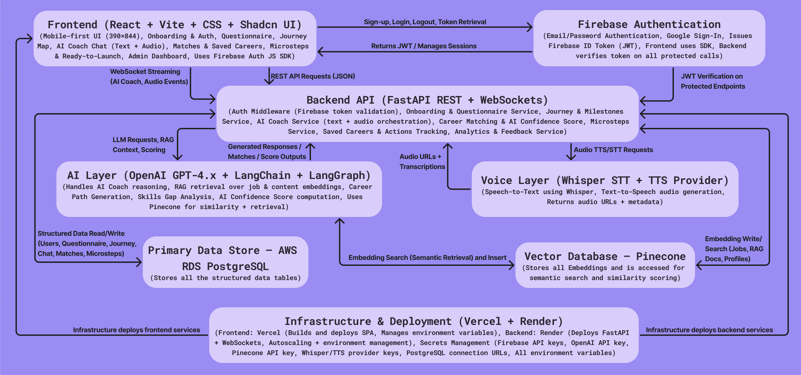

<p align="center">
  
</p>

<h1 align="center">🧭 TruNorth — AI-Powered Career Navigation Platform</h1>

TruNorth is a mobile-first AI career-guidance platform that helps individuals discover strengths, interact with an intelligent AI Coach, explore personalized career paths, and take meaningful action through guided microsteps.  
It blends conversational AI, structured inputs, recommendations, and a clear user journey.

---

## ⭐ Key Features

### **🧠 AI Career Coach (Text + Voice)**
- Real-time text + voice conversation  
- Whisper STT + TTS playback  
- Barge-in behavior and replay controls  
- Personalized outputs using questionnaire + chat history  
- Seamless text ↔ voice switching  

### **📝 Multi-Step Questionnaire**
- 5 structured sections (first 2 required)  
- Autosave  
- Validation-driven flow  
- Unlocks AI Coach upon completion  

### **🔍 Personalized Career Recommendations**
- Embedding-driven matching  
- Fit Score, Growth Trend, Salary Range  
- “Why this fits you” explanation  
- Favorite, dismiss, explore  

### **🪜 Microstep Action System**
- Career-specific guided actions  
- Connect / Reflect / Explore views  
- Live progress tracking  
- AI-generated summaries  
- Completion animation  

### **🚀 Ready to Launch**
- Final reflection  
- Rating + review  
- AI-generated journey summary  
- Updates Journey Map to completion  

### **🖥️ Admin Dashboard**
- Secure admin login  
- User list with search + sorting  
- Full chat transcript viewer  
- Editable AI outputs, tags, comments, nudges  
- Audit logging for all admin actions  

---

## 🏗 System Architecture

<p align="center">
  
</p>

### **Frontend**
- React + Vite  
- Shadcn/UI  
- CSS  
- Zustand  
- Firebase Auth JS SDK  
- WebSockets  
- Mobile-first UI  

### **Backend**
- FastAPI (REST + WebSockets)  
- Firebase token validation  
- Questionnaire, Journey, Recommendation, Microsteps, AI Coach services  
- AI orchestration layer  

### **Databases**
- PostgreSQL (AWS RDS) → structured data  
- Pinecone → embeddings + semantic search  

### **AI Layer**
- GPT-4.x for reasoning  
- LangChain + LangGraph  
- Pinecone for retrieval  
- AI scoring + recommendations  

### **Voice Layer**
- Whisper for Speech-to-Text  
- TTS provider for voice responses  

### **Auth**
- Firebase Authentication  
- Frontend retrieves token  
- Backend verifies JWT  

### **Hosting**
- Frontend → Vercel  
- Backend → Render  
- Database → AWS RDS  
- Vector DB → Pinecone Cloud  

---

## 🧠 AI Confidence Score

The **AI Confidence Score (ACS)** measures how confidently TruNorth can generate accurate and personalized career recommendations.

### **Milestones & Weights**
| Milestone | Weight |
|----------|--------|
| Questionnaire Quality | 20 |
| AI Coach Interaction | 25 |
| Recommendation Match Strength | 25 |
| Microsteps & Actions | 20 |
| Ready to Launch | 10 |

### **Scoring Breakdown**

#### **1. Questionnaire Score (0–20)**
```

completion_rate = answered_required / total_required
completion_score = completion_rate * 12

penalties =
+4 inconsistent answers
+3 vague responses
+5 contradictory inputs

consistency_score = max(0, 8 - penalties)

Final = completion_score + consistency_score

```

#### **2. AI Coach Interaction Score (0–25)**
```

base = 0
if >=3 meaningful turns: +12
if >=1 detailed answer: +8
if on-topic: +5
if drifting: -3

```

#### **3. Recommendation Match Strength (0–25)**
```

avg_similarity (0–1)
RecommendationScore = avg_similarity * 25

```

#### **4. Microsteps & Actions (0–20)**
```

if started microstep: +10
if saved any career: +6
if low dismiss count: +4

```

#### **5. Ready to Launch (0–10)**
```

> =80% microsteps complete: +5
> selected preferred path: +3
> coach confirms readiness: +2

```

### **Final ACS Formula**
```

ActualScore = sum(completed milestone scores)
PossibleScore = sum(weights of completed milestones)

AIConfidence = floor((ActualScore / PossibleScore) * 100)

```

This ensures users are **not penalized** for milestones they haven’t reached yet.

---

## 📁 Project Structure (Updated)

### **Root**
```

trunorth/
│
├── .venv
├── backend/
│   ├── .mypy_cache/
│   ├── .ruff_cache/
│   ├── app/
│   │   ├── api/
│   │   ├── core/
│   │   ├── data/
│   │   ├── models/
│   │   ├── services/
│   │   ├── tests/
│   │   ├── utils/
│   │   ├── **init**.py
│   │   └── main.py
│   ├── venv/
│   ├── .env
│   ├── mypy.ini
│   ├── requirements.txt
│   ├── ruff-config.toml
│   └── runtime.txt
│
└── frontend/
├── public/
└── src/
├── assets/
├── components/
├── data/
├── hooks/
├── pages/
├── services/
├── styles/
├── types/
├── utils/
├── App.tsx
├── index.css
└── main.tsx

```

---

## 🛠 Local Development Setup

### **1. Clone**
```

git clone [https://github.com/Tru-North/TruNorth.git](https://github.com/Tru-North/TruNorth.git)
cd TruNorth

```

### **2. Frontend**
```

cd frontend
npm install
npm run dev

```

### **3. Backend**
```

cd backend
pip install -r requirements.txt
uvicorn app.main:app --reload

```

### **4. Environment Variables**
Copy template:
```

cp .env.example .env

```
Set:
- Firebase config  
- PostgreSQL URI  
- OpenAI key  
- Pinecone key  
- Backend/Frontend URLs  

---

## 🌐 Deployment

### **Frontend — Vercel**
- Auto deploy on push  
- Environment variables via dashboard  

### **Backend — Render**
- FastAPI with Uvicorn/Gunicorn  
- Environment variables in dashboard  

### **Database — AWS RDS**
- PostgreSQL instance  

### **Vector DB — Pinecone**
- Stores embeddings  
- Used for retrieval + scoring  

---

## 🤝 Contributing

1. Fork the repo  
2. Create a feature branch  
3. Follow ESLint/Prettier + Ruff/MyPy  
4. Add tests  
5. Open a pull request  

Contributions welcome.